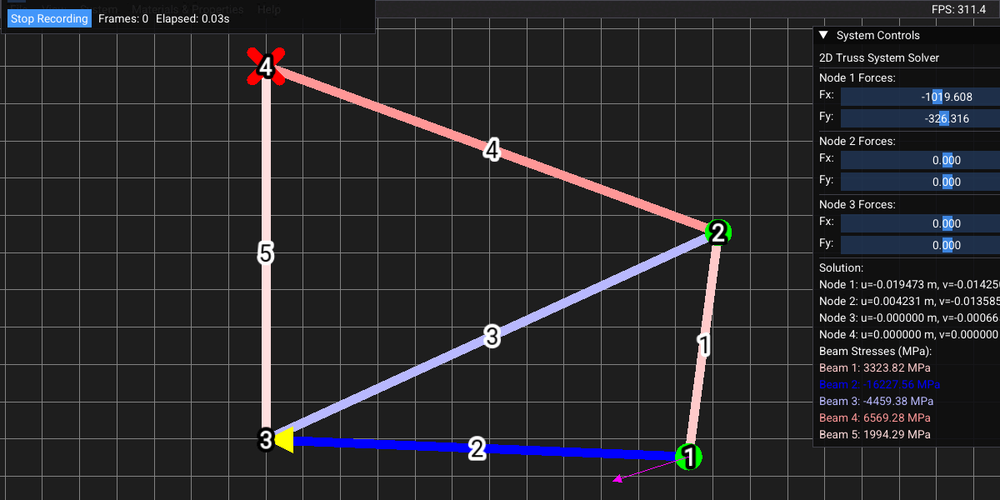

## Fast-FEM

**Author:** [Andre Cox](https://github.com/AndreCox)

Fast-FEM is a compact, high-performance finite element method (FEM) sandbox written in C++ 17 with an immediate-mode GUI for interactive visualization and experimentation. It focuses on clarity and interactivity for rapid prototyping of beam elements, system assembly, and visualization. It supports Windows and Linux.

For detailed documentation, see the [wiki](https://github.com/AndreCox/Fast-FEM/wiki).

<!-- Badges -->

[](https://github.com/AndreCox/Fast-FEM/actions)
[](https://github.com/AndreCox/Fast-FEM/commits/main)
[](#)
[](https://github.com/AndreCox/Fast-FEM/releases)
[](https://tokei.kojix2.net/github/AndreCox/Fast-FEM)

---



---

## Table of Contents

- [Why Fast-FEM?](#why-fast-fem)
- [Highlights](#highlights)
- [Quick Start](#quick-start)
- [Build (detailed)](#build-detailed)
- [Run](#run)
- [Project Layout](#project-layout)
- [Examples & Usage](#examples--usage)
- [Development Notes](#development-notes)
- [Next Steps](#next-steps)

---

## Why Fast-FEM?

Fast-FEM is designed to be intentionally small and readable so you can:

- Quickly prototype beam/truss element code.
- See results immediately via an ImGui + SFML-driven GUI.
- Experiment with numerical ideas without wrestling with a large framework.

It’s ideal for learning, demos, course projects, and small research prototypes.

---

## Highlights

- Lightweight C++17 codebase
- Interactive GUI (ImGui + SFML)
- Example scene files (`courseproject2.ffem`, `oldcourseproject2.ffem`)
- Recording and exporting simulation frames for videos

---

## Quick Start (Assuming Development Environment Setup)

For detailed compilation instructions, see the [Compilation Guide](https://github.com/AndreCox/Fast-FEM/wiki/Compilation) on the wiki.

If you have a C++17-capable compiler, CMake, and standard build tools installed, you can quickly get started:

Clone, configure and build the debug configuration (allows for attaching a debugger and includes debug symbols):

```bash
git clone https://github.com/AndreCox/Fast-FEM.git
cd Fast-FEM
cmake -S . -B build/debug -DCMAKE_BUILD_TYPE=Debug
cmake --build build/debug --config Debug -- -j$(nproc)
```

Run the app:

```bash
./build/debug/main
```

If you prefer Release builds for performance:

```bash
cmake -S . -B build/release -DCMAKE_BUILD_TYPE=Release
cmake --build build/release --config Release -- -j$(nproc)
```

---

## Build (detailed)

For more detailed build instructions and troubleshooting, see the [Build Guide on the Wiki](https://github.com/AndreCox/Fast-FEM/wiki/Compilation).

Prerequisites:

- C++17-capable compiler (GCC/MSVC/Clang)
- CMake 3.15+
- Standard build tools (`make`, `ninja`, etc.)

This repo uses out-of-source CMake builds. Some dependencies are configured as subbuilds under `build/_deps/` when you run CMake; alternatively you can install system packages (e.g., `libeigen3-dev`, `libsfml-dev`) and point CMake to them.

VS Code tasks (preconfigured) are available to run the configure/build steps:

- `Configure Debug` → configures `build/debug`
- `Build Debug` → builds `build/debug`

---

## Run

For more information on running Fast-FEM, see the [Running Guide on the Wiki](https://github.com/AndreCox/Fast-FEM/wiki/Running).

After building execute the generated binary:

```bash
./build/debug/main
```

Helper scripts found in `build/debug/` (after configure/build):

- `debug.sh` — run debug build with useful env settings
- `release.sh` — run the release binary
- `buildtests.sh` — run tests (if present)

Open an `.ffem` file from the app to load a scene.

---

## Project Layout

- `src/` — core sources (`beam.cpp`, `fem_system.cpp`, `graphics.cpp`, `gui_handler.cpp`, `main.cpp`, ...)
- `resources/` — fonts and other assets
- `build/` — CMake out-of-source builds and dependency subbuilds
- `*.ffem` — example project files

---

## Examples & Usage

1. Build Debug and run `./build/debug/main`.
2. In the GUI, open `courseproject2.ffem` to load a demo scene.
3. Edit sources in `src/` and re-build for rapid iteration.

Tip: use `build/debug/compile_commands.json` for editor integrations like code navigation and tooling.

---

## Development Notes + References

### Key References

- **Linear Algebra:** [Eigen](https://eigen.tuxfamily.org/)
- **GUI:** [ImGui](https://github.com/ocornut/imgui), [ImGui-SFML](https://github.com/eliasdaler/imgui-sfml), [SFML](https://www.sfml-dev.org/)
- **Development Practice:** Keep new features small and always add an example demonstrating their behavior.

For more details, see the [wiki](https://github.com/AndreCox/Fast-FEM/wiki) and example `.ffem` files.

---

## Next Steps

- Build and open `courseproject2.ffem` to confirm UI and examples load correctly.
- Want a commit & PR? I can commit this README update and create a branch for you.
